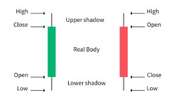
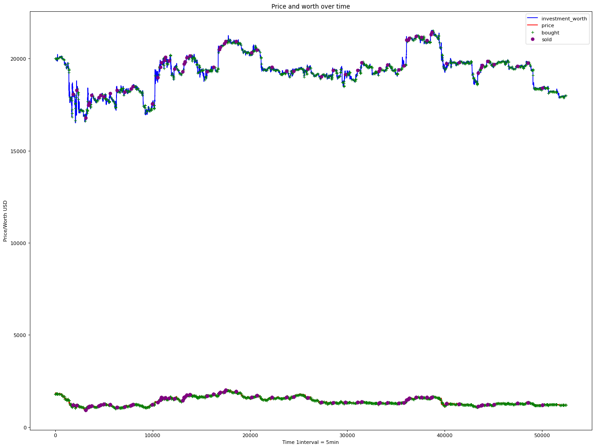

# Research Project 
### Cedric Lagrou


# Environment
#### based on: https://medium.com/coinmonks/deep-reinforcement-learning-for-trading-cryptocurrencies-5b5502b1ece1
## Features
### full Feature list:
#### 'open', 'High', 'Low', 'CLose', 'Invested money', 'non-invested', 'invested_amount of crypto', 'Unix Time', 'MACD', 'SMA60K', 'SMA30K', 'LastBuy', 'LastSold', 'LastBuyPrice', 'LastSoldPrice' 

### Why these features?
#### I used the OHLC as features, because that's what represents the price of the currency at a certain time. The model can use this to help predict a good action for this timestamp.


#### We also have some calculated features, these articles helped me picking some of them to test and use during the project
#### https://www.coindesk.com/learn/3-indicators-beginner-crypto-traders-should-use-according-to-pros/
#### https://academy.swissborg.com/en/learn/crypto-trading-indicators
#### https://www.tradingview.com/scripts/buy-sell/
#### From this article i used:
#### -- Simple Moving Average (SMA)
#### -- Moving Average Convergence Divergence (MACD)
####
#### MACD Formula: MACD=12-Period EMA − 26-Period EMA
#### These are calculated in the environment and put into the dataframe for quicker use during the training
####
#### Last of we also give the information when the model last bought and sold and the prices of those, so he can focus on getting good results

## Researching Reward System
#### The reward is split into 3 parts ( the actions ): 'Hold', 'Buy' and 'Sell'

### HOLD: 
#### in the holding part, we check if the chosen action == 0 ( hold), and we always give a negative reward of 25 to reduce overfiting to action 0 ( that happened when reward was '0')

### Buy:
#### First we check if the current invested money is more than 75% of our current worth e.g. worth = 20.000 --> max invested = 15.000
#### Secondly we check if one of our latest actions was a buy or sell, because we want the AI to know not to sell immediatly or buy everything at once without thinking it's a good buy 
#### If in one of the steps the action doesn't meet the requirement, we return a negative reward, otherwise we Buy and return a postive reward

### Sell:
#### We first check if we have money invested if not, negative reward
#### then we go on to check if we didn't buy or sell in the latest actions, otherwise negative reward
#### if it meets the requirements, the invested amount of Crypto will get fictionally sold, giving a postive reward if it earns more money then invested, and a negative one if it loses money
## Code:
#### We can split the environment into a couple important functions
### Reset function
#### This function basically resets all values to start a new episode and defines the beginning point in the csv

### Step function
#### if an action has been chosen, it will get done in the step function, this will use the get_reward en is_done function to check the reward and see to check if the action has ended the episode
#### it also provides a new state to predict the next action
```{python}
    def step(self, action, interval = 1):
        self.counter +=1
        self.lastBuy -= 1
        self.lastSold -= 1
        self.iterations += 1
        self.action = action
        self.action_history.append(self.action)
        
        #calculate current reward
        self.current_reward = self.get_reward()
        self.done = self.is_done()
        #if the episode is over, give a big negative reward
        if self.done == True:
            self.current_reward - 10000000

        self.total_reward += self.current_reward
        self.reward_history.append(self.current_reward)

        #get next line of data in csv
        if self.csv_index < len(self.df) - 100:
            self.csv_index += interval
            self.current_price = self.df.iloc[self.csv_index, 3:7].values
            self.current_unix_time = self.df.iloc[self.csv_index, 0]
            self.macd =  self.df.iloc[self.csv_index, -1]
            self.sma60 =  self.df.iloc[self.csv_index, -5]
            self.sma30 =  self.df.iloc[self.csv_index, -4]

        else:
            self.done = True
        
        return self.get_current_state(), self.current_reward, self.done
        
```
### Get_reward
#### this function calculates the reward, first of it checks the action.
#### depending on the chosen action, you get a positive or negative reward, see code down below
#### also the selling and buying happens here and the reward of action 2 ( sell) is calculated here by checking if the current price is higher or lower then the price of the last buy ( profit or loss)
```{python}
    def get_reward(self):
        #reward function
        if self.action == 0:
            #hold do nothing
            return -3
        elif self.action == 1:
            if self.invested > ((self.calc_current_worth()/4)*3):
                return -25
                # self.done = True
            elif self.lastBuy > -60 or self.lastSold > -40:
                return -25
                # self.done = True
            else:
                #buy = invest 1/10 of non_invested money
                to_invest = self.non_invested / 5
                self.non_invested -= to_invest
                amount = to_invest / self.current_price[0]
                self.invested += to_invest
                self.invested_amount += amount
                self.lastBuy = 0
                self.lastBuyPrice = self.current_price[0]
                reward = 500
        elif self.action == 2:
            #sell first bought in array of invested
            if self.lastBuy > -10 and self.lastSold > -20:
                reward = -25
            elif self.invested > 10:
                amount = self.invested_amount
                price_investment = self.invested
                self.non_invested += amount * self.current_price[0]
                self.invested_amount = 0
                self.invested = 0
                self.lastSold = 0
                self.lastSoldPrice = self.current_price[0]
                if ((amount * self.current_price[0]) - price_investment) > 0:
                    reward = (((amount * self.current_price[0]) - price_investment))* 50
                else:
                    reward = (((amount * self.current_price[0]) - price_investment)) * 10
            else:
                #hold, do nothing, nothing to sell
                return -25
        
        self.worth_history.append(self.calc_current_worth())
        return (reward) * ((self.calc_current_worth()/self.initial_investment)**2)
        

```
### csv_to_dataframe
#### In this function i make the dataframe that will be used in the training of the trading agent. This can vary upon the csv that is being used.
#### the main things that are being done here are:
#### - adding the macd and sma values to the dataframe
#### - combining multiple csv's into one dataframe
#### - Dropping rows with NaN values ( these can not be predicted )    

# Agent

## Agent choice
#### To choose a good reinforcement learning agent, i started with a simple implementation of a DQN agent and an actor critic.
#### explained: https://medium.com/intro-to-artificial-intelligence/the-actor-critic-reinforcement-learning-algorithm-c8095a655c14
#### The actor critic quickly learned a couple things, whilst the DQN was doing overfitting on one action or randomly picking things, it didn't learn well / quick enough to use this as an agent for this project.
#### for the remainder of this project I will not focus on the DQN implementation, because the training time will make it harder to create and actor critic is an overal better option to use in this case

#### The actor critic performed well, so i went on with the development of that certain agent

## agent explained
#### the actor critic is split into 3 networks: 'Policy', 'Actor' and 'Critic'
#### simply said, the policy choses an action by having an actor picking an action he thinks is best and a critic network evaluating that certain action the actor picked

## code:
#### the code is split into a couple functions
### build actor critic network
#### in this fuction we create the neural networks responsible for predicting the actions.
#### we make an actor, critic and policy network for the actor critic implementation
```{python}
def build_actor_critic_network(self):
    NN_input = Input(shape=(self.input_dims,))
    delta = Input(shape=[1])
    dense1 = Dense(self.fc1_dims, activation='relu')(NN_input)
    dense2 = Dense(self.fc2_dims, activation='relu')(dense1)
    probs = Dense(self.n_actions, activation='softmax')(dense2)
    values = Dense(1, activation='linear')(dense2)
    
    actor = Model(inputs=[NN_input, delta], outputs=[probs])

    actor.compile(optimizer=Adam(lr=self.alpha), loss='categorical_crossentropy')

    critic = Model(inputs=[NN_input], outputs=[values])

    critic.compile(optimizer=Adam(lr=self.beta), loss='mean_squared_error')

    policy = Model(inputs=[NN_input], outputs=[probs])

    return actor, critic, policy
```	
### choose action
#### the model returns a probability for each action, we then use the numpy random choice function to pick an action based on the probabilities

### learn
#### the learn function is the most important function in the actor critic, it is responsible for updating the weights of the actor and critic networks.
## saving the agent

#### I can easily save the 3 models in a folder by using the keras save ( & load) build in functions

## training the model
#### the model itself get trained on the environment with a maxIterations and a number of episodes at a time, we also save some data to make some visals in the end to show the progress of our model and to see where it bought and sold
#### The training is then evaluated in a shorter 'Demo' testset, to see if how it scores, the testset is chosen so it has the opportunity to make some good profits and to check where it bought and sold.

## Model problems
### Overfitting
#### One of the biggest problems i had in the beginning was overfitting to one of the 3 actions: E.g. the model always predicted 'Hold'.
#### To prevent this the reward system had to be tweaked and changed, the overfitted class had a reduction in reward so it balanced the other actions, until i had a model with probabilities that were usable.

### Training time
#### another big factor in reinforcement learning is training time, it takes at least 30minutes to run an episode and to learn from it, so the model needs hours before it reaches a state in which it learned how to decently trade crypto

### hardware restrictions
#### due to me using a laptop 16GB RAM in this project, this lead to me having to fine tweak some things, to optimally run this project and to train it, due to the RAM restriction i had to rerun, because VSCode crashed a couple of times. Better hardware could lead to faster training time, but it worked with the hardware I had to get a baseline to see if it is possible to make a reinforcement agent to trade crypto


# Result
## BTC & ETH
#### The BTC trading bot, still has an urge to sell, this means, if the conditions are met it would rather trigger a sell action. Doing this doesn't meet the requirements, so I believe with further training the model will learn to deal with this, but with the time I had to work with, this seems like a good starting point.

#### the trading bot went from an original investment of 20.000USD to a worth of 27.006, in about the timespan of 183 days doing an action every 5 minutes
#### for comparison, buying on the first day and selling at the end of the 183 days, will result in a worth of 17.363.
####
#### Models were trained approximately 20–24hours.
#### ETH: went from initial investment 20.000 to 17991
#### BTC: went from initial investment 20.000 to 27.006
#### Example of the ETH trading:

# Community
#### I also checked out how the community was doing arround crypto and specifically trading bots.
#### I checked this reddit: https://www.reddit.com/r/algotrading/comments/y31xce/does_your_crypto_trading_bot_still_make_money_in/
#### most people were not happy with the way trading bots are handling current situation, it's a hard time for cryptocurrencies and with that bots became more instable and less profitable.
#### The more famous types like grid-trading, etc still work by the same principles, but the way the cryptoworld is changing the profits are less then before
####
#### Reinforcement learning is a hard topic in the community, not a lot of people share specific things about crypto bots they made, the more traditional bots are still being talked about though.
####
#### I also made a community blogpost: https://medium.com/@cedric.lagrou/crypto-trading-with-reinforcement-learning-cf3b3364c6b

# Extra sources
#### https://link.springer.com/article/10.1007/s10489-022-04322-5#Sec5
#### https://www.tokenmetrics.com/blog/best-indicators-for-crypto-trading-and-analysis
#### https://altfins.com/knowledge-base/chart-patterns/